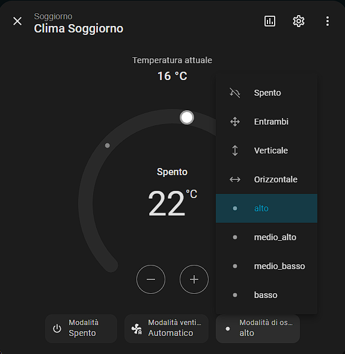

# hOn Integration for Home Assistant

This is a custom component for Home Assistant to integrate with Haier hOn appliances.
This version includes fixes and improvements over the original repository, specifically targeting stability and enhanced control for climate devices.

## Key Improvements

### 🛠️ Stability
- **Network Timeouts**: Added a 30-second timeout to API requests to prevent Home Assistant from hanging indefinitely when hOn servers are unresponsive.
- **Force Reload**: Added a button to force a data refresh from hOn servers (useful if status gets out of sync).

### ❄️ Climate Control
- **Advanced Flap Control**: Added specific vertical swing positions (`High`, `Mid-High`, `Mid-Low`, `Low`) for precise airflow control.
- **Optimistic UI Updates**: Implemented "optimistic" state updates. When you change settings (temp, mode, fan), the UI updates immediately and waits for the confirmation, fixing the annoying "flickering" effect where controls would jump back to the old state.
- **Bug Fixes**: Fixed issues with integer/string type conversions for command parameters.

## Miglioramenti Chiave (Italiano)

### 🛠️ Stabilità
- **Timeout di Rete**: Aggiunto un timeout di 30 secondi alle chiamate API per evitare che Home Assistant si blocchi all'infinito se i server hOn non rispondono.
- **Ricarica Forzata**: Aggiunto un pulsante per forzare l'aggiornamento dei dati dai server hOn (utile se lo stato non è sincronizzato).

### ❄️ Controllo Clima
- **Controllo Avanzato Alette**: Aggiunte posizioni specifiche per le alette verticali (`Alto`, `Medio-Alto`, `Medio-Basso`, `Basso`) per un controllo preciso del flusso d'aria.
- **Aggiornamenti UI "Ottimistici"**: Implementati aggiornamenti di stato istantanei. Quando modifichi temperatura o modalità, l'interfaccia risponde subito senza aspettare la conferma del server, eliminando il fastidioso effetto "flickering" (sfarfallio) dei controlli.
- **Correzione Bug**: Risolti problemi di conversione tipo (intero/stringa) nell'invio dei comandi.

## Installation

1. Click the button above to open HACS directly to this repository.
2. Or manually copy the `custom_components/hon` directory to your Home Assistant `custom_components` directory.
2. Restart Home Assistant.
3. Add the integration via the UI (search for **hOn review**) or click the button below to add it directly.

## Credits

Based on the work by [gvigroux](https://github.com/gvigroux/hon).
